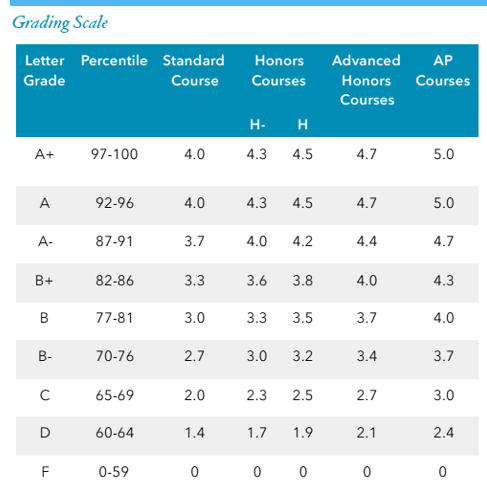

# SSBS GPA Calculator

This is a tool that helps you estimate your GPA score at SSBS.

The source code of this tool is contained in this repository. Feel free to check it out and contribute!

## Suggestions & Issues
You can report suggestions and issues by:
- contacting `JettChenT` in wechat
- opening a github issue in this repository.

## Privacy
Our server does not store any information/statistics regarding your gpa score.

When you share your GPA score with other via an `https://gpa.ssbs.club/#<data>` url, all the data related to your GPA data is stored in the URL itself, 
hence why the shared URL is so long, furthermore, `<data>` is completely hidden from our server and would not be logged.

To estimate the amount of resources to be spent on maintaining this, we keep track of the amount of visitors to our website.

You can view the analytics [here](https://analytics.ssbs.club/share/xcOczTBw/GPA). Now you have as much information as we do :)

## Mobile version
The mobile version(a miniprogram on wechat) is coming soon!

## Calculation 

### Step 1: Overall grade for each course

Weights:

| Part | Weight|
| - | - |
|Term Score| 0.3|
|Midterm| 0.3|
|Finals| 0.4|

The overall score is then calculated as the [weighted average](https://en.wikipedia.org/wiki/Weighted_arithmetic_mean) 
of the entered Term Score, Midterm, Finals.

For example, if you only entered your Midterms and Finals, respectively 84 and 89, your overall grade would be
$\frac{84+89}{0.3+0.4} = 86.857$

### Step 2: GPA for each course
Your GPA for each course will be calculated
based on your overall grade and the course level, as shown
below.

For example, with an overall grade of $86.857$ in an AP course, since $86.857>86.5$, it would be rounded up to $87$ and considered as `A-`, which means a GPA of $4.7$ for an AP level course.

### Step 3: Combining your GPA for each course
The overall GPA is calculated as the 
weighted average of the GPAs for each course, 
in which the weight for each course is the number of periods there is each week.

For example, for 10th graders, Geography would have a weight of 0.5

#### Example
|course|weight|gpa|
|-|-|-|
|Math|5|4.2|
|Literature|5|4.4|
|Elective|3|3.5|
|Politics|0.5|3.3|

Your final GPA would be calculated as:
$$\frac{4.2*5+4.4*5+3.5*3+3.3*0.5}{5+5+3+0.5} = 4.085$$